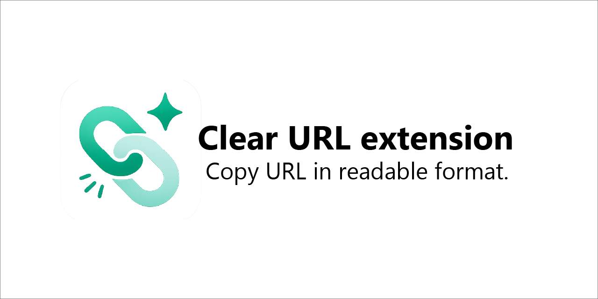

  

  🇺🇸 <a href="README.md">English</a> |
  🇸🇦 <a href="README.ar.md">العربية</a> |
  🇨🇳 <a href="README.zh.md">中文</a> |
  🇩🇪 <a href="README.de.md">Deutsch</a> |
  🇫🇷 <a href="README.fr.md">Français</a> |
  🇯🇵 <a href="README.ja.md">日本語</a> |
  🇷🇺 <a href="README.ru.md">Русский</a> |
  🇵🇹 <a href="README.pt.md">Português</a> |
  🇪🇸 <a href="README.es.md">Español</a>

# 🔗 Clear URL extension
Chrome extension to copy URLs in a clean, readable format instead of encoded ones (Arabic, Chinese, etc.)

## ✨ Features
- Copy URL in readable format (Arabic, Chinese, etc.)
- Remove tracking parameters (utm, fbclid, etc.)
- Right-click context menu support
- Simple and fast

## 🚀 Installation
1. Download or clone the repo
2. Go to chrome://extensions
3. Enable Developer Mode
4. Click "Load unpacked"
5. Select the extension folder

## 🧠 Why?
Browsers like Chrome copy URLs in encoded format:
%d9%85%d8%b3%d9%84%d8%b3%d9%84
This extension converts them into:
مسلسل
## 🤝 Contributing
Pull requests are welcome!

## 📜 License
MIT
